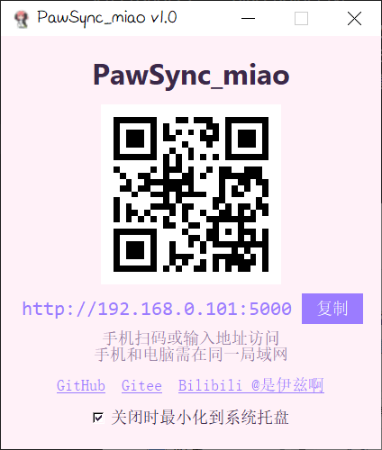

# PawSync_miao

<div align="center">


一只帮你偷懒的小猫爪 🐾

[GitHub](https://github.com/xiaofeiji7/PawSync_miao) | [Gitee](https://gitee.com/cold-nine/PawSync_miao) | [Bilibili @是伊兹啊](https://space.bilibili.com/432322151)

</div>

---

它适合那种很普通、但又很真实的场景：人在公司上班，电脑前要输入一大段文字，可手就是不想敲键盘。于是你拿起手机，对着输入法语音说几句，再轻轻一点，文字就跑到电脑上了。

不用在微信、文件传输助手、聊天窗口之间来回复制。
不用把手机里的话重新打一遍。
不用为了几句话打断当前正在做的事。

让手机负责听你说话，让电脑负责把文字接住。

## 它能做什么

- 手机打开一个小页面，输入或语音识别一段文字。
- 点一下发送，文字会出现在电脑当前正在输入的位置。
- 电脑端会显示二维码和访问地址，手机扫码就能用。
- 关闭窗口时可以藏到右下角，不打扰你继续工作。
- 图标、页面和小猫都已经准备好，看起来不会太硬邦邦。

## 适合什么时候用

- 上班时懒得敲一大段话。
- 想用手机语音识别帮电脑输入文字。
- 临时把手机上的一段内容发到电脑当前窗口。
- 不想打开聊天软件，也不想来回复制粘贴。
- 想要一个轻一点、可爱一点的小工具陪着干活。

## 下载安装

### 方式一：直接下载 exe（推荐）

前往 [Releases](https://github.com/xiaofeiji7/PawSync_miao/releases) 页面下载最新版本的 `PawSync_miao.exe`，双击运行即可。

### 方式二：从源码运行

```bash
# 克隆仓库
git clone https://github.com/xiaofeiji7/PawSync_miao.git
cd PawSync_miao

# 安装依赖
pip install -r requirements.txt

# 运行程序
python main.py
```

### 方式三：自己打包

```bash
# 安装依赖后运行打包脚本
python build.py
```

打包后的 exe 会生成在 `dist/PawSync_miao.exe`。

## 界面预览

<div align="center">

### 📱 移动端界面


### 💻 桌面端界面


</div>

## 怎么用

1. 打开 `PawSync_miao.exe`。
2. 用手机扫描窗口里的二维码。
3. 在手机页面输入文字，或者直接用手机输入法语音识别。
4. 先点一下电脑上要接收文字的位置。
5. 回到手机点"发送到设备"。

文字就会自动出现在电脑当前光标所在的位置。

## 技术栈

- **Python 3.8+**
- **Flask** - Web 服务
- **PyAutoGUI** - 自动化输入
- **qrcode** - 二维码生成
- **Pillow** - 图像处理
- **pystray** - 系统托盘
- **pyperclip** - 剪贴板操作

## 小提醒

- 手机和电脑需要连在同一个网络里。
- 发送前，电脑上要先选中你想输入文字的地方。
- 如果电脑弹出防火墙提示，允许之后手机才能访问。
- 如果图标看起来还是旧的，可能是 Windows 缓存了旧图标，换个文件名或刷新一下通常就好了。

## 常见问题

**Q: 手机无法访问电脑？**  
A: 确保手机和电脑在同一局域网，并且防火墙允许 5000 端口。

**Q: 发送后没有反应？**  
A: 发送前需要先在电脑上点击要输入文字的位置（让光标处于输入状态）。

**Q: 支持 Mac/Linux 吗？**  
A: 目前仅支持 Windows，其他平台需要修改部分代码。

## 开源协议

本项目采用 [MIT License](LICENSE) 开源协议。

## 关于作者

- **GitHub**: [xiaofeiji7](https://github.com/xiaofeiji7)
- **Gitee**: [cold-nine](https://gitee.com/cold-nine)
- **Bilibili**: [@是伊兹啊](https://space.bilibili.com/432322151)

---

`PawSync_miao` 的目标很简单：把"我想说的话"更快地送到电脑上。

它不是复杂的大软件，也不想打扰你。它就像一只蹲在桌角的小猫爪，平时安安静静，需要的时候帮你把文字轻轻推过去。